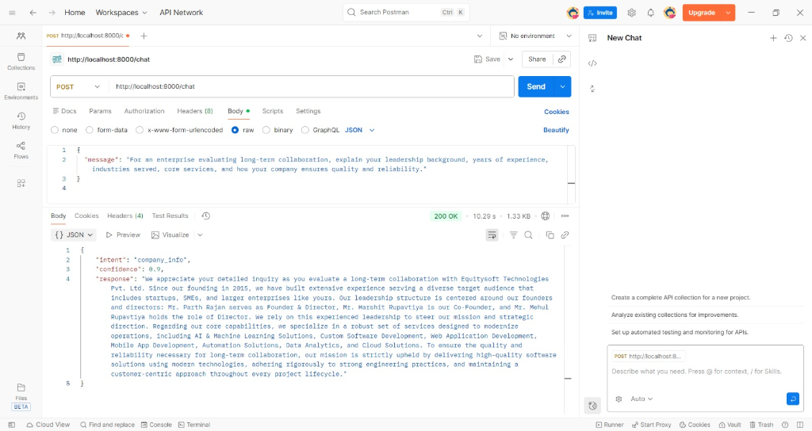
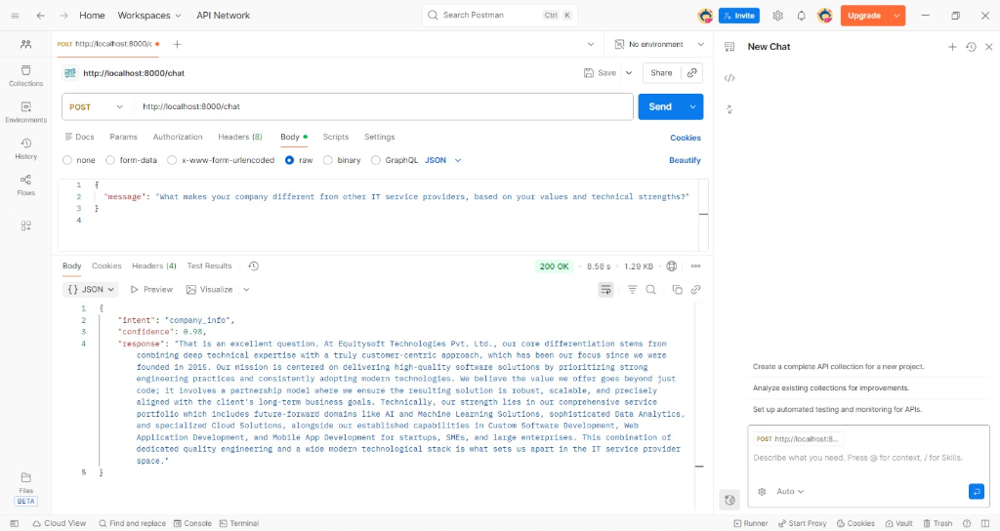
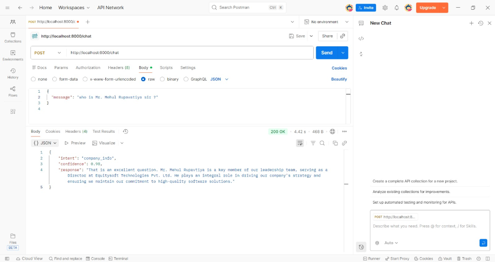
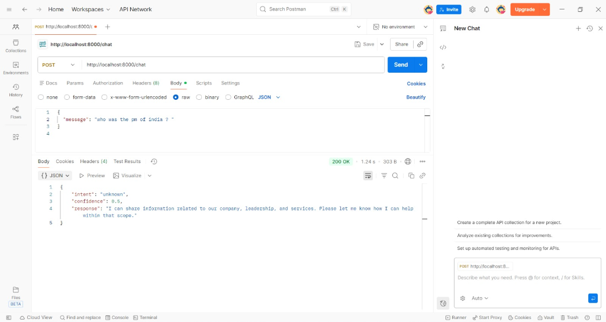

# AI Agent Backend POC

## Overview
This project is a Proof of Concept (POC) for a production-grade AI Agent Backend designed to simulate a Botpress-style conversational experience. It is built using Python and FastAPI, focusing on deterministic intent routing, context-aware responses, and strict adherence to business data.

The system is designed to be **provider-agnostic**, supporting both Google Gemini and OpenAI (ChatGPT) models via a unified abstraction layer.

## Architecture & Design Principles

The architecture follows a strict separation of concerns to ensure reliability and maintainability.

### 1. Intent-Based Routing
Unlike generic chatbots that send every query to an LLM, this agent first classifies the user's intent.
- **Detector**: `app/intent.py`
- **Mechanism**: Zero-shot classification using the configured LLM provider.
- **Intents**: `company_info`, `service_info`, `business_growth`, `support`, `unknown`.
- **Purpose**: To allow specific handling logic for different types of queries (e.g., forcing factual accuracy for leadership questions).

### 2. Provider Agnostic Layer
The system does not couple business logic with specific AI vendors.
- **Abstraction**: `app/llm_provider.py`
- **Function**: `generate_ai_response(prompt: str) -> str`
- **Switching**: Controlled via the `AI_PROVIDER` environment variable (`gemini` or `openai`).
- **Benefit**: Vendor lock-in is eliminated; migrating providers requires zero code changes.

### 3. Deterministic Context (RAG-Lite)
Business knowledge is not hallucinated by the model training data. It is injected at runtime.
- **Source**: `data/business_profile.json`
- **Loading**: `app/context.py` loads this immutable state into memory.
- **Reloading**: The context is reloaded on every request during development to allow real-time updates without server restarts.

### 4. Strict Leadership Logic
To prevent AI hallucination or excessive flattery regarding company leadership:
- **Mechanism**: When `company_info` intent is detected regarding leadership, `app/responses.py` overrides the standard prompt.
- **Deterministic**: Founder/Director names are extracted directly from JSON and formatted via string manipulation.
- **Instruction**: The LLM is explicitly forbidden from adding adjectives (e.g., "visionary") or inventing backstories.

## Project Structure

```
d:/ai_agent_poc/
├── app/
│   ### Key Components
│   - `app/main.py`: Entry point and API definition.
│   - `app/agent.py`: Orchestrator binding the components.
│   - `app/intent.py`: Logic for classifying user input into granular intents (`leadership_info`, `services_info`, `company_overview`, `business_growth`, `support`). Includes heuristic confidence scoring (0.40 - 0.95).
│   - `app/context.py`: Data loader for business profile.
│   - `app/responses.py`: Generation logic for text responses. Includes "Safety Guard" for unknown intents.
│   ├── schemas.py       # Pydantic models for API contracts
│   └── llm_provider.py  # Abstraction layer for Gemini/OpenAI
├── data/
│   └── business_profile.json  # The Source of Truth for company data
├── requirements.txt     # Python dependencies
├── .env                 # API Keys and Provider Configuration
└── README.md            # Technical Documentation
```

## Setup & Configuration

### Prerequisites
- Python 3.9+
- A Google Cloud API Key (for Gemini) OR an OpenAI API Key.

### Installation
1. Install dependencies:
   ```bash
   pip install -r requirements.txt
   ```

2. Configure Environment:
   Create a `.env` file in the root directory:
   ```ini
   # Configuration
   AI_PROVIDER=gemini  # Options: 'gemini' or 'openai'

   # Keys
   GEMINI_API_KEY=your_gemini_key_here
   OPENAI_API_KEY=your_openai_key_here  # Optional if using Gemini
   ```

### Running the Server
Start the development server with hot-reload enabled:
```bash
python -m uvicorn app.main:app --reload
```
The API will be available at `http://localhost:8000`.

## API Usage

### Chat Endpoint
**POST** `/chat`
- **Description**: The main entry point for user interaction.
- **Request Body**:
  ```json
  {
    "message": "Who founded the company and what do you do?"
  }
  ```
- **Response**:
  ```json
  {
    "intent": "company_info",
    "confidence": 0.98,
    "response": "Equitysoft Technologies was founded in 2015 by Mr. Parth Rajan. We specialize in custom software development, AI solutions, and mobile application development for startups and enterprises."
  }
  ```

## Technical Implementation Details

### Response formatting
The system enforces strict formatting rules on the LLM output:
- **Plain Text Only**: Markdown (bold, lists, headers) is stripped or forbidden via system prompts.
- **Paragraphs**: Responses are returned as natural, conversational paragraphs.
- **Tone**: Professional yet friendly. It handles respectful address (e.g., "Sir") with appropriate warmth.

### Error Handling
The application includes graceful fallback mechanisms:
- If an API key is missing or invalid, it returns a clear error message rather than crashing.
- If the intent detection fails, it defaults to `unknown` intent with a safe fallback response.

## Future Improvements
- **Persistent Memory**: Integrate Redis or a database to store conversation history for multi-turn context.
- **Vector Search**: Replace the static JSON context with a Vector Database (e.g., Pinecone/Chroma) for querying large knowledge bases.
- **Admin UI**: Build a frontend dashboard to edit `business_profile.json` safely.

## API Gallery

### 1. Complex Multi-Part Query
The agent handles complex questions combining history, services, and leadership in one go.


### 2. Value Proposition
Demonstrates the agent's ability to articulate unique selling points professionally.


### 3. Leadership Inquiry
Shows the **deterministic leadership override** in action—factual, non-promotional, and accurate.


### 4. Safety Guard (Unknown Intent)
Demonstrates the fallback mechanism when specific knowledge is outside the business scope.


